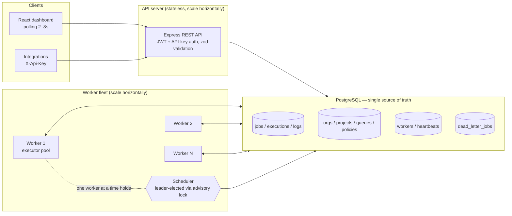
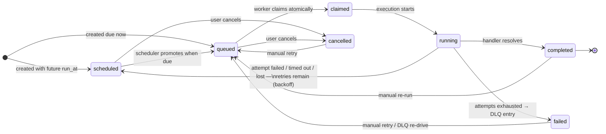

# Architecture

## System overview



Three process types, one shared datastore:

1. **API server** — stateless Express app. Authenticates dashboard users (JWT) and integrations (project API keys), validates input with zod, enforces RBAC, and reads/writes Postgres. Any number can run behind a load balancer.
2. **Workers** — long-running processes that claim due jobs, execute registered handlers with per-job timeouts, report heartbeats, and conclude each attempt (success / retry with backoff / dead-letter). Every worker also *competes* for scheduler leadership; exactly one wins at a time.
3. **PostgreSQL** — the queue itself. All coordination (claiming, locking, leases, leader election) happens through Postgres primitives, so there is no additional broker to deploy. The trade-offs of this choice are discussed in [design-decisions.md](design-decisions.md#1-postgres-as-the-queue).

## Job state machine



State lives in `jobs.status`; **every attempt** is recorded immutably in `job_executions` (the retry history), and human-readable events go to `job_logs`. Retries are implemented as a transition back to `scheduled` with `run_at = now() + backoff`, so the claim path never needs special retry logic.

## The hot path: atomic claiming

The single most important invariant: **a job is never executed by two workers at once**. Claiming (in `core/claim.ts`) runs in one transaction per queue:

```sql
BEGIN;
-- 1. Per-queue mutex: serializes claimers of the SAME queue so the
--    capacity/rate computations below are race-free. Different queues
--    proceed fully in parallel. Blocking is fine: the critical section
--    is single-digit milliseconds and only one queue is locked per
--    transaction (no deadlock possible).
SELECT pg_advisory_xact_lock(hashtextextended('codity:queue:<id>', 0));

-- 2. Race-free capacity checks (inside the mutex):
--    slots = min(worker capacity,
--                queue.max_concurrency - COUNT(claimed|running),
--                rate budget for the current second)

-- 3. Atomic claim of the winners:
UPDATE jobs j SET status = 'claimed', claimed_by = $worker, claimed_at = now(),
                  lease_expires_at = now() + (timeout + grace)
WHERE j.id IN (
    SELECT id FROM jobs
    WHERE queue_id = $1 AND status = 'queued'
    ORDER BY priority DESC, run_at, id       -- dispatch order
    LIMIT $slots
    FOR UPDATE SKIP LOCKED                   -- never wait on row locks
) RETURNING j.*;
COMMIT;
```

Design notes:

- `FOR UPDATE SKIP LOCKED` is the canonical Postgres work-queue primitive: readers never block on rows locked by a concurrent transaction (e.g. a cancel in flight).
- The advisory lock exists because **queue-level limits** (max concurrency, rate) cannot be checked race-free by row locking alone — two claimers could both count "4 running < 5" and overshoot. The mutex makes the check + claim atomic per queue.
- The claim scan is served by a **partial index** `ON jobs (queue_id, priority DESC, run_at, id) WHERE status = 'queued'`, which stays tiny regardless of how much completed history accumulates.
- Workers drain queues in `queues.priority DESC` order, and jobs within a queue in `jobs.priority DESC, run_at, id` order (priority, then FIFO).

This is verified by tests that fire 24 concurrent claim attempts at 5 jobs and assert every job is claimed exactly once (`tests/integration/claim.test.ts`).

## Worker execution pipeline

```
claim (atomic) ──► startExecution        ──► handler(ctx)            ──► completeExecution
                   claimed → running          AbortSignal timeout         running → completed
                   +job_executions row        ctx.log / ctx.progress
                                          └─► failExecution: retry backoff → 'scheduled'
                                                             exhausted     → 'failed' + DLQ
```

- Each worker runs up to `WORKER_CONCURRENCY` handlers concurrently in-process; polling re-fires immediately while there is both work and capacity, otherwise sleeps `POLL_INTERVAL ± 20%` jitter (de-synchronizes fleets).
- Handlers receive `{ payload, signal, log(), progress() }`. Logs persist to `job_logs`, progress to `jobs.progress` — both visible live in the dashboard.
- Timeouts race the handler against the job's `timeout_ms` with an `AbortSignal`; a timed-out attempt is a normal failure (`timed_out`) that consumes an attempt.
- **Graceful shutdown** (`SIGTERM`/`SIGINT`): stop claiming → status `draining` → wait up to `DRAIN_TIMEOUT` for in-flight jobs → status `offline`. Anything still running is recovered later via lease expiry.

## Scheduler: one leader, three duties

Every worker runs a `SchedulerLeader` that tries `pg_try_advisory_lock('codity:scheduler-leader')` on a dedicated session. Exactly one holds it; if that process dies, its connection drops, Postgres releases the lock, and another worker takes over within one tick. The leader ticks every second:

1. **Promotion** — `scheduled → queued` for jobs whose `run_at` arrived (delayed jobs and retry backoffs).
2. **Cron materialization** — for each due row in `scheduled_jobs` (`FOR UPDATE SKIP LOCKED`), insert a concrete job and advance `next_run_at`. Missed occurrences during downtime are *skipped, not backfilled* — recovery does not cause a thundering herd.
3. **Reaping (failure detection)** —
   - Workers whose `last_heartbeat_at` is older than `DEAD_WORKER_AFTER_MS` are marked `dead`.
   - Jobs whose **lease expired** or whose worker is dead are reclaimed: the running execution is marked `lost`, and the job re-enters the normal retry path (or the DLQ if attempts are exhausted). A `claimed`-but-never-started job is requeued without consuming an attempt.

## Failure model & guarantees

| Failure | Detection | Recovery |
|---|---|---|
| Handler throws | worker catches | retry with backoff → DLQ when exhausted |
| Handler hangs | client-side `AbortSignal` timeout | attempt marked `timed_out`, normal retry path |
| Worker process killed (`kill -9`) | missed heartbeats (~20s) | worker marked `dead`; its jobs marked `lost` and retried on other workers |
| Worker alive but frozen | per-job lease (`timeout + grace`) expires | same `lost` path, even though heartbeats continue |
| Scheduler leader dies | advisory lock auto-releases | another worker acquires leadership within ~1 tick |
| Worker finishes *after* its lease was reaped | status-guarded transitions | late result is discarded and logged; the reaped retry wins |

**Delivery semantics: at-least-once.** A job whose worker dies mid-execution will run again, so handlers should be idempotent (clients can also use idempotency keys at enqueue time for exactly-once *enqueue*). `lost` attempts consume an attempt, which bounds poison jobs that repeatedly kill workers — the same reasoning as SQS's receive-count. All of this is exercised in `tests/integration/scheduler.test.ts` and was observed live: killing a worker mid-`demo.flaky` produced a `lost` attempt 3 recovered by a second worker as attempt 4.

## Scaling notes

- **API**: stateless — add instances freely.
- **Workers**: add processes/machines; claiming contention is per-queue and the critical section is ~1–3 ms, so tens of workers per queue are fine. Queue subscriptions (`WORKER_QUEUES`) shard the fleet by workload class.
- **Postgres**: the choke point by design. The claim path is one indexed scan + one UPDATE per poll; history tables (`job_executions`, `job_logs`, `worker_heartbeats`) are the main growth area and are prunable (heartbeats already auto-prune at 24h). The next steps at real scale — partitioning `jobs` by status/time, counter caches for stats, or swapping the transport for a dedicated broker while keeping this schema as the system of record — are discussed in [design-decisions.md](design-decisions.md).
