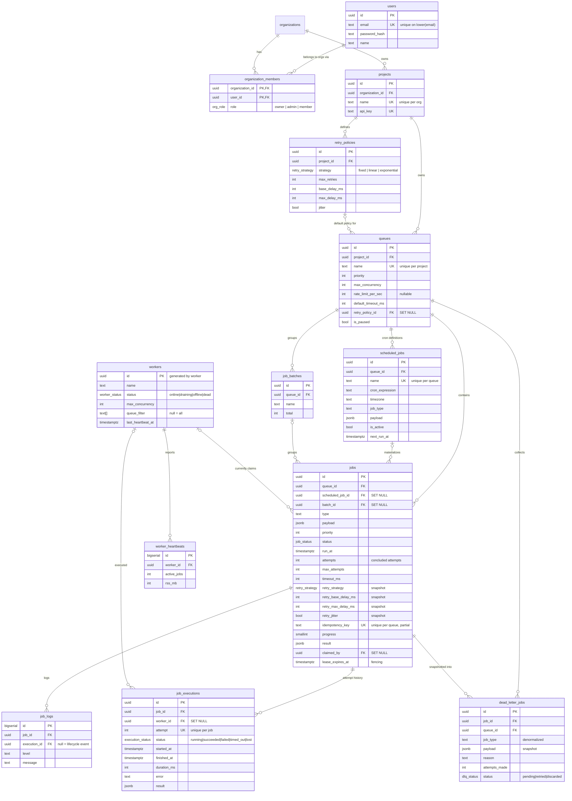

# Database Design

Schema lives in [`server/src/db/migrations/001_initial.sql`](../server/src/db/migrations/001_initial.sql), applied by a small hand-rolled migration runner (`db/migrate.ts`) that records applied files in `schema_migrations` and runs each migration in its own transaction.

## ER diagram

## Design principles

**Keys.** Every entity uses a `uuid` surrogate primary key (`gen_random_uuid()`, built into PG 13+) — safe to expose in URLs, mergeable across environments, no sequence contention. Append-only telemetry (`job_logs`, `worker_heartbeats`) uses `bigserial` instead: cheaper, and insertion order is meaningful there. Natural keys are enforced as UNIQUE constraints where they exist: `lower(email)`, `(organization_id, name)`, `(project_id, name)`, `(queue_id, name)`, `(job_id, attempt)`, and the partial `(queue_id, idempotency_key)`.

**Normalization.** The schema is 3NF — configuration (queues, policies), identity (users/orgs/projects), execution state (jobs), and telemetry (executions, logs, heartbeats) are separate relations with FK-enforced ownership chains. There are two *deliberate* denormalizations:

1. **Retry snapshot on `jobs`** (`retry_strategy`, `retry_base_delay_ms`, `retry_max_delay_ms`, `retry_jitter`, `max_attempts`). Copied from the resolved policy at enqueue time. Editing or deleting a policy therefore never changes the behavior of jobs already in flight — retries stay predictable, and the hot failure path needs no join. The policy tables remain the *source* of configuration; the snapshot is the *contract* for one job.
2. **`dead_letter_jobs` snapshots `job_type` + `payload`.** A DLQ entry must stand alone for inspection and re-drive even as the live `jobs` row moves on (e.g. after a manual retry mutates status/attempts).

**Job state vs. history.** The `jobs` row holds only *current* state; every attempt is an immutable `job_executions` row (`UNIQUE (job_id, attempt)`) recording worker assignment, timing, outcome, and error. This is what powers the retry-history UI and per-worker/throughput metrics without ever parsing logs.

## Cascade behavior

| Relationship | Rule | Why |
|---|---|---|
| org → members, projects; project → queues, policies; queue → jobs, schedules, batches, DLQ; job → executions, logs | `ON DELETE CASCADE` | Ownership chains: deleting a tenant object removes everything it owns, no orphans |
| `queues.retry_policy_id` | `SET NULL` | Deleting a policy falls back to platform defaults; in-flight jobs keep their snapshot |
| `jobs.claimed_by`, `job_executions.worker_id`, `created_by`, `resolved_by` | `SET NULL` | Audit references must survive pruning of workers/users |
| `jobs.scheduled_job_id`, `jobs.batch_id` | `SET NULL` | A job's origin is informational; deleting the origin shouldn't delete history |

## Indexing strategy

The claim path is the hot path, so its indexes are **partial** — they only contain rows in the state the query looks for, keeping them small and cache-resident no matter how much completed history accumulates:

| Index | Serves |
|---|---|
| `jobs (queue_id, priority DESC, run_at, id) WHERE status='queued'` | **The claim scan** — matches the claim `ORDER BY` exactly |
| `jobs (run_at) WHERE status='scheduled'` | Scheduler promotion of due jobs |
| `jobs (lease_expires_at) WHERE status IN ('claimed','running')` | Reaper's expired-lease scan |
| `jobs (claimed_by) WHERE status IN ('claimed','running')` | "What is this worker running" + dead-worker reclaim |
| `jobs (queue_id, idempotency_key) WHERE idempotency_key IS NOT NULL` (UNIQUE) | Exactly-once enqueue via `ON CONFLICT DO NOTHING` |
| `jobs (queue_id, created_at DESC)` / `jobs (queue_id, status)` | Dashboard listings and per-status counts |
| `jobs (batch_id) WHERE batch_id IS NOT NULL` | Batch progress rollups |
| `job_executions (job_id, started_at)` / `(worker_id, started_at DESC)` | Retry history, per-worker stats |
| `job_executions (finished_at) WHERE finished_at IS NOT NULL` | Time-bucketed throughput charts |
| `scheduled_jobs (next_run_at) WHERE is_active` | "Which schedules are due" |
| `workers (status, last_heartbeat_at)` | Liveness scan |
| `dead_letter_jobs (queue_id, status, failed_at DESC)` | DLQ listings |

## Data integrity in depth

- **Enums as Postgres types** (`job_status`, `execution_status`, `worker_status`, `retry_strategy`, `org_role`, `dlq_status`) — invalid states are unrepresentable at the storage layer, and enum comparison is cheaper than text.
- **CHECK constraints** guard numeric ranges (`max_concurrency BETWEEN 1 AND 1000`, `progress BETWEEN 0 AND 100`, `max_delay_ms >= base_delay_ms`, timeout bounds…), so even a buggy code path can't persist nonsense.
- **`updated_at` triggers** on mutable tables (`queues`, `jobs`, `scheduled_jobs`) keep modification times honest regardless of which code path writes.
- **Case-insensitive email uniqueness** via a functional unique index on `lower(email)` — no `citext` extension dependency.
- **Timestamps are `timestamptz`** everywhere; the application treats time as UTC and formats at the edge.

## Performance considerations & growth path

- Status counts and throughput aggregate over indexed predicates and a bounded time window (60 min / 24 h); at assignment scale these are single-digit-ms queries. At much larger scale the natural next steps are: counter caches on `queues` maintained transactionally, pre-aggregated minute rollups for charts, and range-partitioning `jobs`/`job_executions` by `created_at` so completed history ages out of the working set entirely.
- `worker_heartbeats` is the fastest-growing table (one row per worker per 5 s); the scheduler prunes rows older than 24 h and deletes long-dead worker rows, bounding it by design.
- JSONB is used only for genuinely schema-free data (payloads/results). Everything the engine reasons about — status, timing, retry parameters — is a typed column, so it is indexable and constraint-checked.
